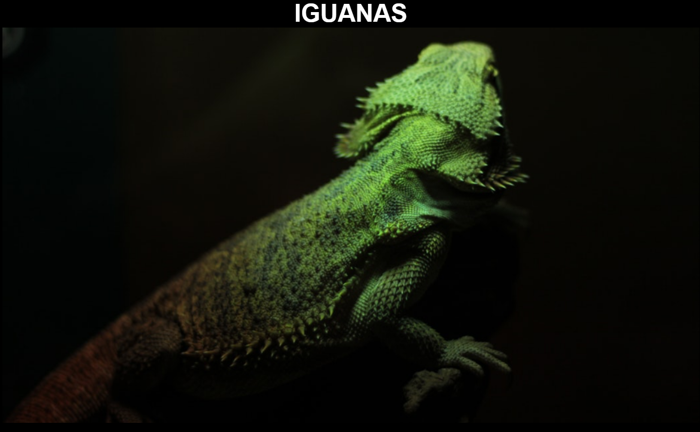

# Ejercicio de Flexbox

Este proyecto es un ejercicio para mejorar el uso de flexbox en HTML y CSS. El objetivo es crear una página web que muestre información sobre iguanas, utilizando flexbox para organizar y alinear los elementos de manera efectiva.

La página incluye una sección de introducción, una sección de características y una galería de imágenes. Cada sección utiliza flexbox para lograr una distribución y alineación específica de los elementos.
Este ejercicio busca mejorar las habilidades en el uso de flexbox para crear layouts responsivos y atractivos.

